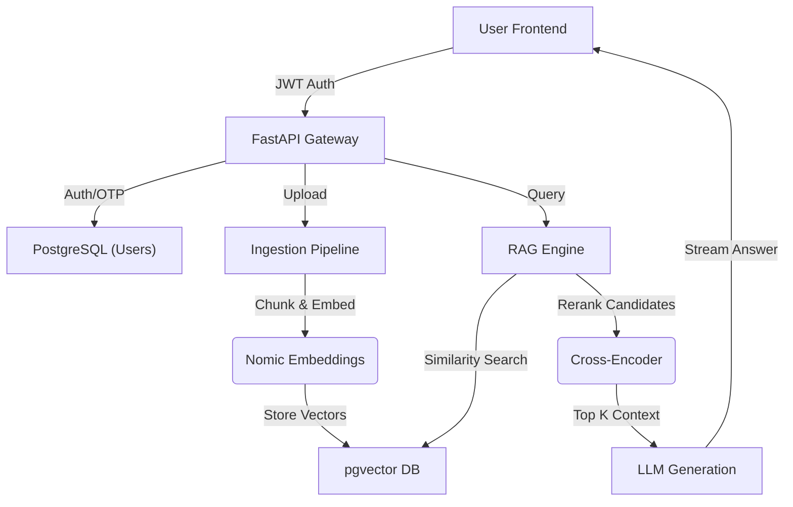

# Enterprise RAG: Executive Intelligence System 🧠✨

> A production-grade Retrieval-Augmented Generation (RAG) platform designed for enterprise document intelligence. Built with **FastAPI**, **PostgreSQL**, and a highly interactive **React** frontend using the "Modern Executive" design system.


## 🚀 Key Features

### 🔍 Advanced RAG Pipeline (Backend)
The core of the system is a sophisticated hybrid retrieval engine:
- **Embeddings**: Uses `nomic-ai/nomic-embed-text-v1.5` (512 dimensions) for high-quality semantic vectorization.
- **Reranking**: Implements `cross-encoder/ms-marco-MiniLM-L-6-v2` to re-score retrieval results for maximum relevance.
- **Vector Database**: **pgvector** (PostgreSQL) for scalable vector similarity search.
- **Chunking Strategy**: Smart recursive character splitting with overlap to preserve context.

### 📚 Rich Metadata & Traceability (Key Feature)
Unlike standard RAG that just dumps text, this engine preserves **granular context**:
- **Precise Citations**: API responses return exact **Page Numbers** and **Chunk Indices** for every piece of evidence.
- **Source Attribution**: The LLM is instructed to cite sources (e.g., `[Source 1]`) which map back to specific file locations.
- **Preview Context**: Retrieval results exclude raw header/footer noise but retain semantic context windows.

### 🛡️ Enterprise Authentication
- **Dual Auth System**:
  - **Google OAuth2**: Seamless corporate login integration.
  - **Secure Email/Password**: Custom flow with **OTP Verification** (SMTP).
- **Security**:
  - Password hashing via **bcrypt** (no weak MD5/SHA structures).
  - JWT Tokens with auto-expiry and HttpOnly references.
  - Role-based route protection.

### 💻 "Modern Executive" Frontend
A stunning, high-performance UI built for professional environments:
- **Glassmorphism UI**: Dark mode, translucent panels, and focused accents (`#6366f1` Indigo / `#10b981` Emerald).
- **Interactive Chat**: Streaming AI responses with visible "Thinking Process" indicators.
- **Source Verification**: Clickable citations `[Source 1]` open a drawer showing:
  - Document Name & ID
  - Page Number
  - Relevance Score (Color-coded)
  - Full Text Content

---

## 🏗️ Architecture Overview



## 🛠️ Tech Stack

| Component | Technology | Description |
|-----------|------------|-------------|
| **Backend** | Python 3.12+, FastAPI | High-performance async API server |
| **Database** | PostgreSQL + pgvector | SQL + Vector storage in one DB |
| **ML Models** | Nomic V1.5, MS-MARCO | SOTA embeddings and reranking models |
| **Frontend** | React, Vite, TypeScript | Modern, type-safe SPA architecture |
| **Styling** | Vanilla CSS (Variables) | "Cyber-Executive" custom design system |
| **Auth** | OAuth2, JWT, Bcrypt | Enterprise-grade security standards |

---

## 🚀 Getting Started

### Prerequisites
- Python 3.10+
- Node.js 18+
- PostgreSQL 15+ (with `pgvector` extension)

### 1. Backend Setup
```bash
# Clone the repository
git clone https://github.com/your-repo/enterprise-rag.git
cd enterprise-rag

# Create virtual environment
python -m venv venv
source venv/bin/activate  # or venv\Scripts\activate on Windows

# Install dependencies
pip install -r requirements.txt

# Setup Environment
cp .env.example .env
# Edit .env with your DB credentials and API keys
```

### 2. Frontend Setup
```bash
cd frontend

# Install dependencies
npm install

# Run development server
npm run dev
```

### 3. Running the System
Start the backend API:
```bash
python -m uvicorn src.api:app --reload --host 0.0.0.0 --port 8000
```
*Access API Docs at: `http://localhost:8000/docs`*

---

## 📚 API Documentation

### Retrieval Endpoint (`/query`)
The query response includes detailed metadata for traceability:

```json
{
  "answer": "According to the policy...",
  "sources": [
    {
      "source_id": "Source 1",
      "document": "Employee_Handbook_2024.pdf",
      "page_number": 12,
      "chunk_index": 45,
      "relevance_score": 0.89,
      "content_preview": "Employees must submit expense reports..."
    }
  ]
}
```

### Ingestion Endpoint (`/upload`)
- **Input**: PDF/DOCX/TXT files (Multipart).
- **Process**: OCR/Text Extraction → Chunking (512 tokens) → Embedding → Storage.

---

## 🔒 Security Notes
- `.env` files are git-ignored. **Do not commit them.**
- The system supports SMTP configuration for real OTP delivery.
- Google OAuth requires a valid GCP Client ID configured in `.env`.
